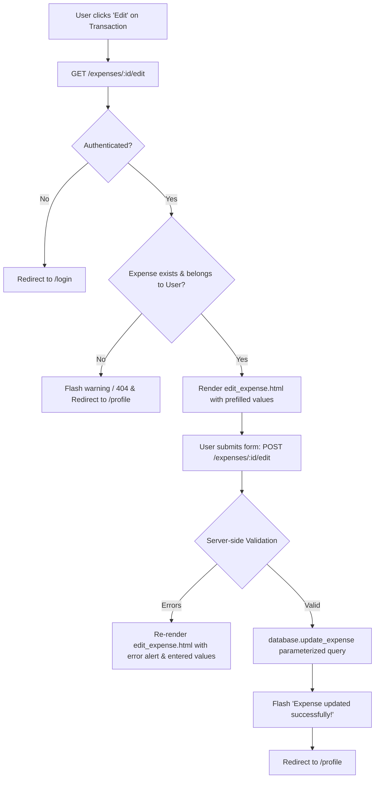

# Implementation Plan — Step 08: Edit Expense

This plan details the implementation of the **Edit Expense** feature (`GET /expenses/<id>/edit` and `POST /expenses/<id>/edit`) for Spendly, building upon the existing expense creation (Step 06) and profile dashboard (Steps 04 & 05).

---

## Goal Description
Allow authenticated users to edit any existing expense they created. When editing, the form is pre-populated with current transaction values (amount, category, date, description). Upon saving valid changes, the record is updated in SQLite, and the user is redirected to the profile dashboard where recalculated totals and charts immediately reflect the change. Strict authorization checks ensure users can never access or modify expenses belonging to other users.



---

## User Review Required

> [!IMPORTANT]
> **Authorization & IDOR Protection**: If an authenticated user attempts to access `GET /expenses/<id>/edit` or submit `POST /expenses/<id>/edit` for an `id` that belongs to another user (or is non-existent), the application will protect the data by flashing a warning message `"Expense not found or unauthorized access."` and redirecting back to `/profile` (or returning 404).

> [!NOTE]
> **Profile UI Table Update**: We will add an `ACTIONS` column with a sleek, accessible "Edit" link button to each transaction in `templates/profile.html` Recent Transactions table.

---

## Open Questions
*None — requirements and conventions cleanly match Step 06 (Add Expense) and project rules.*

---

## Proposed Changes

Grouped by component layer:

### 1. Database Layer (`database/db.py`)

#### [MODIFY] `database/db.py`
Add database helper functions:
1. `get_expense_by_id(expense_id, user_id=None)`: Fetches an expense row by its primary key `id`, optionally filtering by `user_id`.
2. `update_expense(expense_id, user_id, amount, category, date, description="")`: Updates the expense row where `id = ? AND user_id = ?` using parameterized queries and returns `cursor.rowcount > 0`.

```python
def get_expense_by_id(expense_id, user_id=None):
    """Fetches an expense by ID, optionally verifying ownership by user_id."""
    conn = get_db()
    cursor = conn.cursor()
    if user_id is not None:
        cursor.execute("SELECT * FROM expenses WHERE id = ? AND user_id = ?;", (expense_id, user_id))
    else:
        cursor.execute("SELECT * FROM expenses WHERE id = ?;", (expense_id,))
    expense = cursor.fetchone()
    conn.close()
    return expense


def update_expense(expense_id, user_id, amount, category, date, description=""):
    """Updates an expense record for a specific user using parameterized query."""
    conn = get_db()
    cursor = conn.cursor()
    clean_desc = description.strip() if description else ""
    cursor.execute(
        """
        UPDATE expenses
        SET amount = ?, category = ?, date = ?, description = ?
        WHERE id = ? AND user_id = ?;
        """,
        (float(amount), category.strip(), date.strip(), clean_desc, expense_id, user_id),
    )
    conn.commit()
    rows_affected = cursor.rowcount
    conn.close()
    return rows_affected > 0
```

---

### 2. Application Routes (`app.py`)

#### [MODIFY] `app.py`
1. Import `get_expense_by_id` and `update_expense` from `database.db`.
2. Implement `edit_expense(id)` with `GET` and `POST` methods:
   - Check authentication (`session.get("user_id")`).
   - Check ownership via `get_expense_by_id(id, user_id)`. If `None`, redirect to `/profile` with warning flash.
   - On `GET`: Render `edit_expense.html` pre-populated with expense fields and `categories=ALLOWED_CATEGORIES`.
   - On `POST`: Extract and validate form inputs (`amount`, `category`, `date`, `description`).
     - Validation: Required fields, positive float amount, category in `ALLOWED_CATEGORIES`, valid `YYYY-MM-DD` date.
     - On validation error: Re-render `edit_expense.html` with error message, entered values, and `expense_id=id`.
     - On valid: Call `update_expense(...)`, flash `"Expense updated successfully!"`, and redirect to `url_for("profile")`.

```python
@app.route("/expenses/<int:id>/edit", methods=["GET", "POST"])
def edit_expense(id):
    user_id = session.get("user_id")
    if not user_id:
        flash("Please log in to edit an expense.", "warning")
        return redirect(url_for("login"))

    expense = get_expense_by_id(id, user_id=user_id)
    if not expense:
        flash("Expense not found or unauthorized access.", "warning")
        return redirect(url_for("profile"))

    if request.method == "POST":
        amount_raw = request.form.get("amount", "").strip()
        category = request.form.get("category", "").strip()
        date_raw = request.form.get("date", "").strip()
        description = request.form.get("description", "").strip()

        # Validation: required fields
        if not amount_raw or not category or not date_raw:
            return render_template(
                "edit_expense.html",
                error="Amount, Category, and Date are required.",
                expense={"id": id, "amount": amount_raw, "category": category, "date": date_raw, "description": description},
                categories=ALLOWED_CATEGORIES,
            )

        # Validation: positive numeric amount
        try:
            amount = float(amount_raw)
            if amount <= 0:
                raise ValueError("Amount must be positive.")
        except ValueError:
            return render_template(
                "edit_expense.html",
                error="Please enter a valid positive amount.",
                expense={"id": id, "amount": amount_raw, "category": category, "date": date_raw, "description": description},
                categories=ALLOWED_CATEGORIES,
            )

        # Validation: category
        if category not in ALLOWED_CATEGORIES:
            return render_template(
                "edit_expense.html",
                error="Please select a valid expense category.",
                expense={"id": id, "amount": amount_raw, "category": category, "date": date_raw, "description": description},
                categories=ALLOWED_CATEGORIES,
            )

        # Validation: date
        if not is_valid_date(date_raw):
            return render_template(
                "edit_expense.html",
                error="Please enter a valid date in YYYY-MM-DD format.",
                expense={"id": id, "amount": amount_raw, "category": category, "date": date_raw, "description": description},
                categories=ALLOWED_CATEGORIES,
            )

        success = update_expense(
            expense_id=id,
            user_id=user_id,
            amount=amount,
            category=category,
            date=date_raw,
            description=description,
        )

        if success:
            flash("Expense updated successfully!", "success")
        else:
            flash("Failed to update expense.", "danger")

        return redirect(url_for("profile"))

    return render_template(
        "edit_expense.html",
        expense=expense,
        categories=ALLOWED_CATEGORIES,
    )
```

---

### 3. Frontend Templates & CSS

#### [NEW] `templates/edit_expense.html`
Jinja2 template extending `base.html` providing:
- Back link to dashboard (`url_for('profile')`).
- Form card matching `add_expense.html` aesthetics.
- Pre-filled inputs for Amount (`₹`), Category dropdown, Date picker, and Description.
- "Save Changes" primary button with icon and "Cancel" secondary button.

#### [MODIFY] `templates/profile.html`
- Update Recent Transactions table `<thead>` to include an `ACTIONS` column header (`<th class="text-right">ACTIONS</th>`).
- In table `<tbody>`, add an Edit action link `<a href="{{ url_for('edit_expense', id=tx['id']) }}" class="tx-action-link edit-link" aria-label="Edit expense">...</a>`.

#### [MODIFY] `static/css/style.css`
- Add styling for `.tx-action-link`, `.edit-link` with hover transitions, subtle background accents, and responsive alignment.

---

### 4. Automated Testing Suite

#### [NEW] `tests/test_08_edit_expense.py`
Pytest suite covering:
1. **DB Function Unit Tests**:
   - `get_expense_by_id` fetches single record correctly and respects `user_id`.
   - `update_expense` modifies fields and returns `True`; returns `False` if `user_id` does not match.
2. **Auth & Ownership Tests**:
   - Unauthenticated `GET /expenses/<id>/edit` redirects to `/login`.
   - Unauthenticated `POST /expenses/<id>/edit` redirects to `/login`.
   - IDOR prevention: User B cannot access `GET /expenses/<User A id>/edit` or `POST /expenses/<User A id>/edit`.
   - Non-existent ID returns redirect or 404 with warning flash.
3. **Form Rendering**:
   - Authenticated user gets pre-populated amount, category, date, and description.
4. **Valid Form Submission**:
   - `POST` with valid modifications updates DB, redirects to `/profile`, flashes success.
5. **Validation Errors**:
   - Empty/missing fields, negative/zero amount, non-numeric amount, invalid category, invalid date format display proper error messages and preserve values.
6. **Dashboard Synchronization**:
   - Editing an expense amount or category updates the total spent, category list breakdown, and transaction row on `/profile`.

---

## Verification Plan

### Automated Tests
Run full pytest suite to verify all existing and new tests pass:
```powershell
pytest -v tests/test_08_edit_expense.py
pytest
```

### Manual Verification
1. Log in as demo user (`demo@spendly.com` / `demo123`).
2. Navigate to Dashboard (`/profile`).
3. Click "Edit" on an existing transaction in the Recent Transactions list.
4. Verify all fields (amount, category, date, description) are pre-filled correctly.
5. Edit the amount, change category to a different one, modify description, and click "Save Changes".
6. Verify redirect to `/profile` with `"Expense updated successfully!"` flash alert.
7. Verify the updated transaction appears with new details and dashboard metrics/totals recalculate.
8. Test invalid input (e.g. negative amount `-50`) and confirm inline validation alert shows up without losing inputs.
